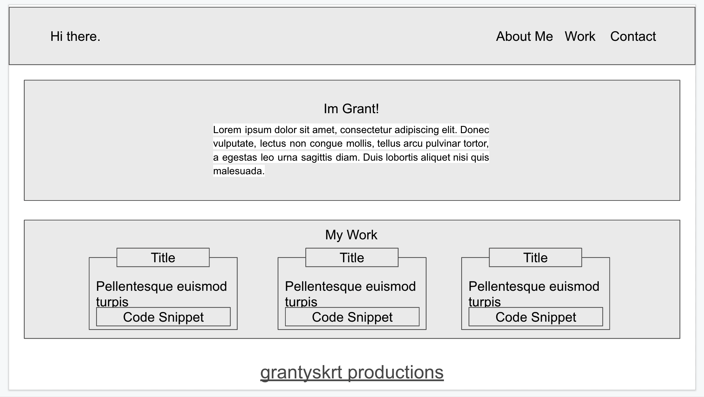

# Challenge-2
# Personal Portfolio

# Purpose
In this Module we learned about advanced CSS and using Flexbox. We needed to create a personal portfolio for ourselves. This portfolio will be used in the present and future to showcase my work done with coding, graphics, and other things I find interesting. I enjoyed the creative freedom we were given during this challenge and I plan to build out my portfolio extensively throughout my career.

-Grant Huiras

# Built With
*HTML *CSS

# Mock-up Sketch

# Website
[https://github.com/mcnugboy/c-2](https://mcnugboy.github.io/c-2/)
